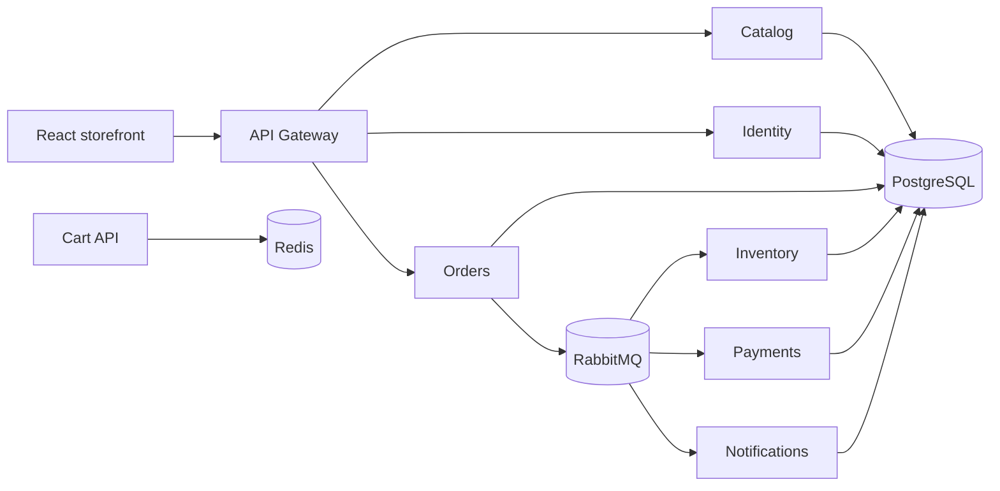

# Enterprise E-Commerce Platform

A local-first .NET 10 microservices demo with a React storefront. It demonstrates database-per-service persistence, a gateway, Redis-backed carts, and an asynchronous order workflow driven by RabbitMQ.

## What This Demonstrates

- DDD-style Catalog boundaries with MediatR query handling
- PostgreSQL database-per-service migrations and demo seed data
- API Gateway routing for catalog, identity, and orders
- Transactional outboxes and idempotent RabbitMQ consumers
- Inventory reservation followed by development payment processing
- A responsive storefront that displays the final asynchronous order state

## Architecture



The local demo uses Docker Compose. Kubernetes manifests remain available under `infrastructure/kubernetes`, but are not required for the demo.

## Tech Stack

- Frontend: React, TypeScript, Vite, Nginx
- Backend: ASP.NET Core Minimal APIs on .NET 10
- Persistence: PostgreSQL 17 and Entity Framework Core migrations
- Messaging: RabbitMQ 4
- Cache: Redis 7
- Tests: xUnit and the .NET test platform

## Quick Start

Requirements: Git and Docker Desktop with Compose v2. No local .NET SDK, Node.js, PostgreSQL, Redis, or RabbitMQ installation is required for the full demo.

```powershell
git clone <repository-url>
Set-Location aktma-Enterprise-E-Com
Copy-Item .env.example .env
docker compose up --build
```

The first build downloads the .NET and Node base images and may take several minutes. Services apply their migrations on startup. Catalog and inventory are seeded automatically with four fictional products and useful stock levels.

## Access

| Component | URL |
| --- | --- |
| Storefront | http://localhost:5173 |
| API Gateway health | http://localhost:5101/health |
| Catalog API health | http://localhost:5013/health |
| Gateway OpenAPI document | http://localhost:5101/openapi/v1.json |
| RabbitMQ management | http://localhost:15672 |

RabbitMQ demo credentials are `ecommerce` / `demo_password` unless changed in `.env`. The gateway is the browser-facing API. Direct service ports are listed in `docker-compose.yml` for inspection and smoke testing.

## Demo Workflow

1. Open the storefront and browse the seeded catalog.
2. Add a product to the bag and enter any valid email address at checkout.
3. The gateway creates an order in the Orders service.
4. RabbitMQ delivers `order.created` to Inventory, which reserves seeded stock.
5. Payments processes the development payment and publishes completion.
6. The storefront polls the gateway and reports the final order state instead of treating `201 Created` as completion.

The development payment provider automatically completes the demo workflow. Its decline branch is covered by unit tests and is reserved for direct workflow exercises; the storefront does not connect to a real payment provider.

## Smoke Test

Start Compose first, then run:

```powershell
.\scripts\smoke-test.ps1
```

The script checks service health, verifies seeded catalog data, creates an order, and waits for `Confirmed` or `Failed`.

## Development Checks

```powershell
dotnet test EnterpriseECommerce.slnx
Push-Location frontend/ecommerce-web
npm ci
npm run build
Pop-Location
docker compose config
```

For focused local development, the backend can be run with the .NET SDK and the frontend with Vite, but the Compose path is the supported clone-and-run experience.

## Project Structure

- `frontend/ecommerce-web`: React storefront
- `src/Gateway`: browser-facing API gateway
- `src/Services`: Catalog, Identity, Cart, Inventory, Orders, Payments, and Notifications
- `src/BuildingBlocks/Messaging`: shared RabbitMQ contracts and infrastructure
- `infrastructure/docker`: service image definitions
- `infrastructure/postgres`: database bootstrap script
- `tests/Unit`: domain and workflow unit tests
- `docs/architecture.md`: boundary and workflow notes

## Configuration

Copy `.env.example` to `.env` only when running Compose. It contains safe local demo values; do not use them outside local development. Database names are created by PostgreSQL's initialization script, and application migrations run automatically. Changing database credentials after the volume exists requires resetting the local volume.

## Troubleshooting

- View startup errors with `docker compose logs -f` or a specific service such as `docker compose logs orders-api`.
- If a port is already used, change the host side of the relevant `ports` entry in `docker-compose.yml` and update the URL you open.
- To reset all local demo data, run `docker compose down -v` and then `docker compose up --build`. This deletes the local PostgreSQL, Redis, and RabbitMQ volumes.
- If a service is restarting, check that Docker has enough memory and inspect its logs. PostgreSQL and RabbitMQ health checks must pass before dependent services start.

## Known Limitations

- The storefront cart remains browser-local; the Cart API is available separately for demonstrating Redis persistence.
- Authentication is implemented, but checkout remains a public demo workflow because order authorization is not yet enforced.
- The payment provider is intentionally a development implementation and does not contact a real payment service.
- This README describes the local demo only; Kubernetes deployment material is not part of local startup.

## License

See [LICENSE](LICENSE).