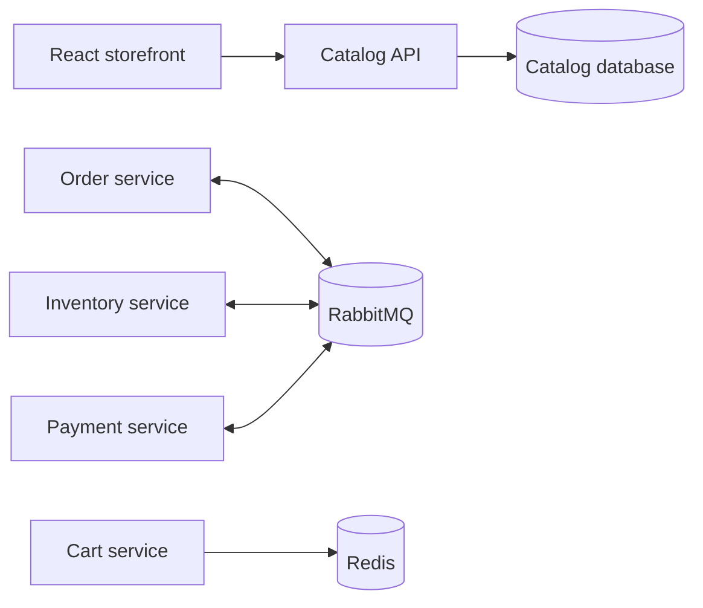

# Architecture

## Boundary Map

The repository currently contains the first complete Catalog slice. Catalog data is accessed through an application port and its infrastructure adapter; controllers/endpoints do not own business logic. The repository adapter is intentionally in-memory until the EF Core/PostgreSQL persistence slice is added.

## Decisions

- **Database per service:** prevents accidental coupling and makes ownership explicit.
- **CQRS with MediatR:** command/query handlers create a testable application boundary without forcing every method through a mediator.
- **RabbitMQ for workflows:** inventory and payment are asynchronous because an order cannot safely span service transactions.
- **Outbox next:** state changes and published integration events will be coordinated through an outbox table before multi-service checkout is enabled.

## Delivery Order

Catalog persistence and contract tests come next, followed by Identity, Inventory, Cart, Orders, Payments, Notifications, Gateway, and Kubernetes deployment. Each service should be completed as a tested vertical slice before the order workflow is connected.