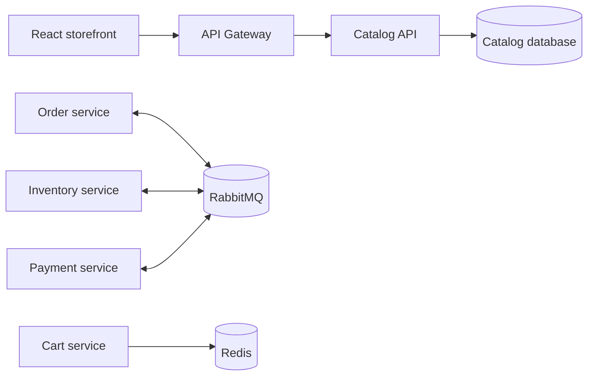

# Architecture

## Boundary Map

The repository contains runnable API slices for Catalog, Identity, Cart, Inventory, Orders, Payments, Notifications, and the Gateway. Catalog uses an application port and infrastructure adapter; the workflow services use EF Core database-per-service persistence and hosted RabbitMQ consumers.

## Decisions

- **Database per service:** prevents accidental coupling and makes ownership explicit.
- **CQRS with MediatR:** command/query handlers create a testable application boundary without forcing every method through a mediator.
- **RabbitMQ for workflows:** inventory and payment are asynchronous because an order cannot safely span service transactions.
- **Outbox:** Orders and Inventory persist outgoing events before publishing them, while consumers record message IDs for idempotency.

## Delivery Order

The local demo path is Docker Compose with PostgreSQL, Redis, and RabbitMQ. Kubernetes deployment is kept as separate portfolio material. The next hardening steps are integration coverage, authenticated order ownership, and compensation tests for cancellation and payment failure.